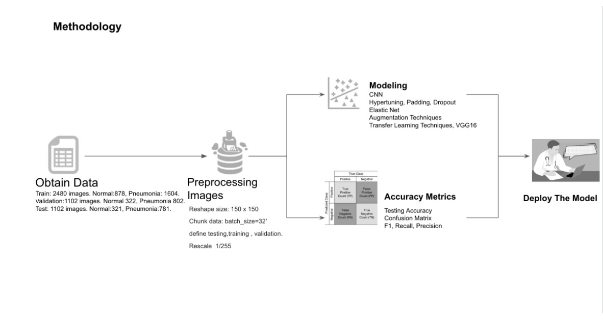
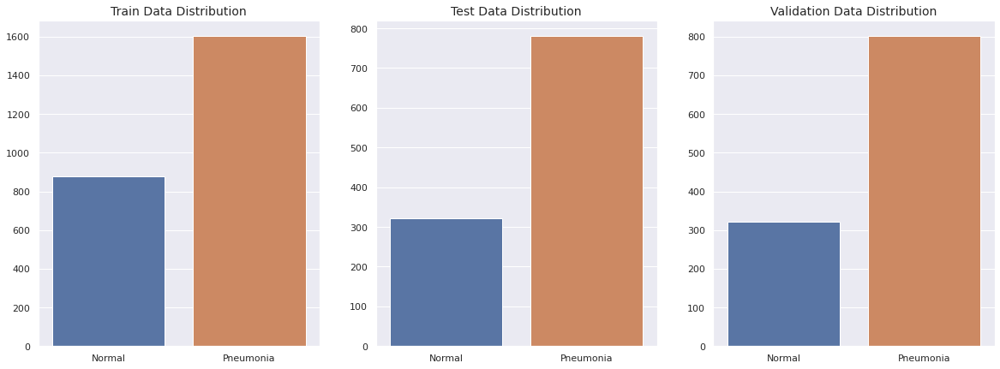
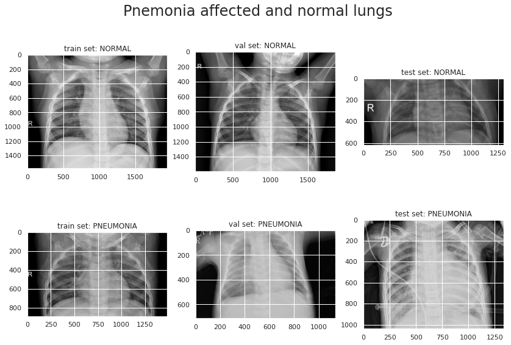
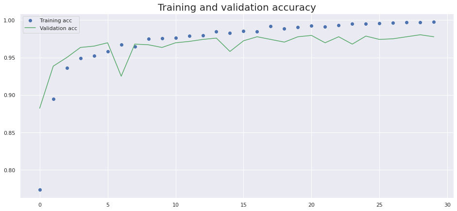
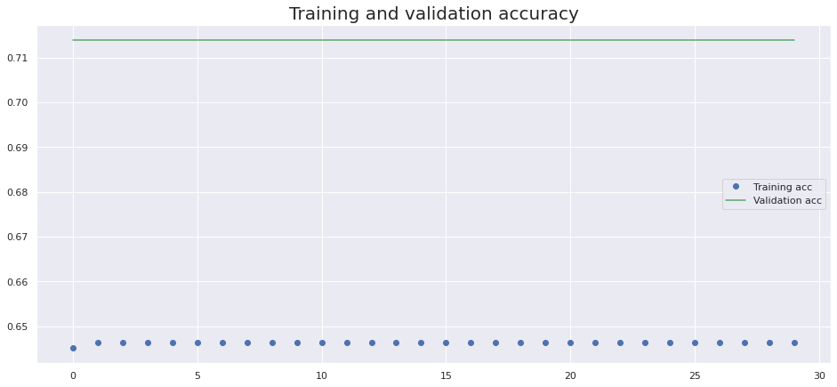
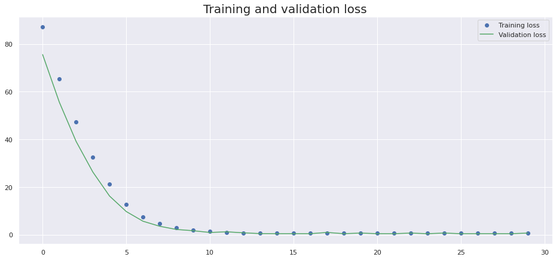
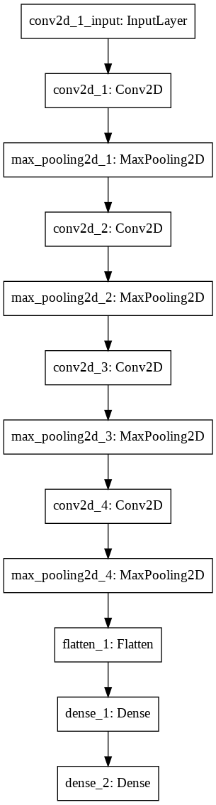
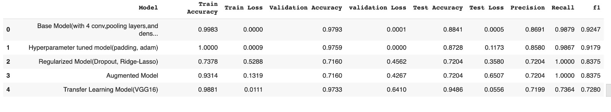

# Pneumonia Diagnosis Using Deep Learning Techniques

## X-RAY IMAGE CLASSIFICATION 
###  By Khulood Nasher & Seyma Tas

## Introduction
### Define the Problem

Disease diagnosis with radiology is a common practice in medicine  but requires doctors to interpret the results from the x-ray images. Due to the increase in the number of patients and the low availability of doctors, there was a need for a new method to diagnose .
Fortunately machine learning has introduced the solution for this problem . In this project we are going to introduce deep learning models and techniques in diagnosing pneumonia.
Through this project, we applied deep learning CNN techniques in image classification and we followed the data science methodlogy as follows:

# Obtain Data:

## Preprocessing Images:

* All the images were reshaped to size 150 by 150

* Load image data from the hierarchical file 'chest_xray' using an image datagenerator.

* define testing,training , validation.

* Decode the JPEG content to RGB grids of pixels.

* reshape all images to same size of 150 x 150 pixels

* Convert pixels into floating point tensors

* chuck data by "batch_size=32'

* Rescale the pixel values( between o and 255) to the [0,1] interval.

## About the X-ray images data:
An input of  total x-ray images of 4,704  were  downloaded  from kaggle, 

https://www.kaggle.com/paultimothymooney/chest-xray-pneumonia. 

The data images in  kaggle was not split appropriately, so we split the images  manually  with percentages of :60% train, 20% val, 20% test.

Our image data were as follows:

## Train data:
 
 2480 images belong to 2 classes: Normal and pneumonia.The Normal images in the training set  are 878 images, while the pneumonia images are 1604 images which is 
 
 almost double the number.

## Validation Data:

There are 1102 images belonging to 2 classes:Normal and pneumonia.The Normal images in the training set  are 322 images, while the pneumonia images are 802 images 
which is almost double the number.

## Test data:

There are 1102 images belonging to 2 classes:Normal and pneumonia.The Normal images in the training set  are 321 images, while the pneumonia images are 781 images 
which is almost double the number.

# Methodology:

## Question1: How is an image classification model typically designed?

We can divide this process broadly into 4 steps. Each step requires a certain amount of time to execute: https://www.analyticsvidhya.com/blog/2019/01/build-image-classification-model-10-minutes/

###  Loading and pre-processing Data – 30% time

### Defining Model architecture – 10% time

### Training the model – 50% time

### Estimation of performance – 10% time

Train data - used to make CNN adjust weights(parameters)

Validation Data - used to make CNN adjust hyperparameters. This has to be done manually

Test Data - Final testing of performance
We will need to go back after each iteration, fine-tune my steps, and run it again. Having a solid understanding of the underlying concepts will go a long way in accelerating the entire process.
 
 
### Training the model

For training the model, we require:

Training images and their corresponding true labels, used  CNN deep learning and adjust weights(parameters) through hypertuning parameters such as: Padding,Dropout, 
Elastic Net,Augmentation techniques,Transfer Learning Techniques,VGG16.

Validation images and their corresponding true labels (we use these labels only to validate the model and not during the training phase)

We also define the number of epochs. we ran all the models for 30 epochs.

## Construct Architecture of the Base Model:

### CNN
Layers used to build ConvNets. As we described above, a simple ConvNet is a sequence of layers, and every layer of a ConvNet transforms one volume of activations 
to another through a differentiable function. We use three main types of layers to build ConvNet architectures: Convolutional Layer, Pooling Layer, and Fully-
Connected Layer (exactly as seen in regular Neural Networks). We will stack these layers to form a full ConvNet architecture.

## Summary of the Results:

## Conclusion:
Finally, We can say that the weight of our base model and VGG 16 are the best because the Recall was 99% in base model but it was 75% in VGG16. However, the testing accuracy is 95% in VGG16 but it is 88% in base model.

Base model and VGG16 are sharing same sequense architecture , but the number of trainable paramters in base model is 3.5 milion while the number of trinable 
parameters in VGG16 are 15 milion. The good weight of parameters from base model is ideal and that's what increase the Recall metric but the transformation of the 
image in addition to the weight of imagenet was also great for high accuracy. 
In conclusion, I recommed using my base model and VGG 16 as a reliable tool to be 
deployed in the medical ceneters for diagnosing pneumonia.

